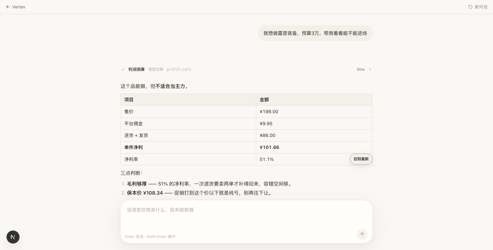
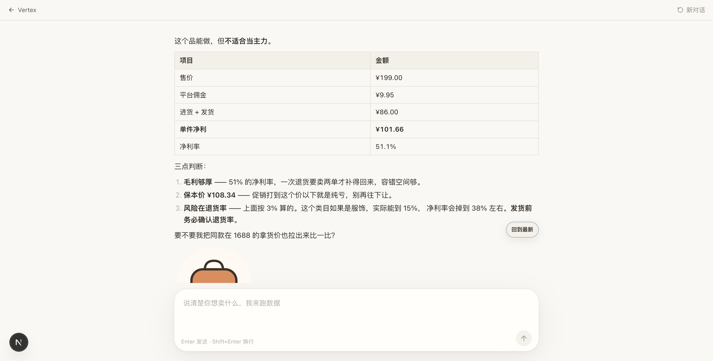
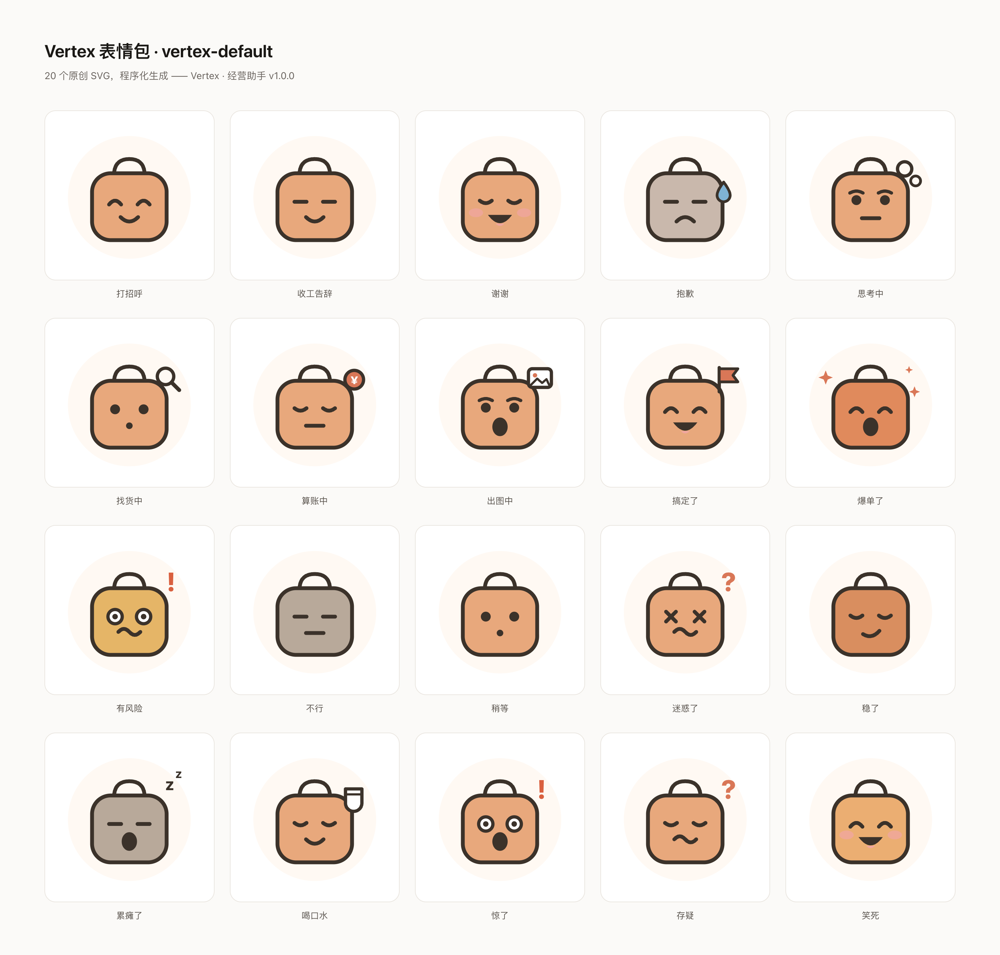
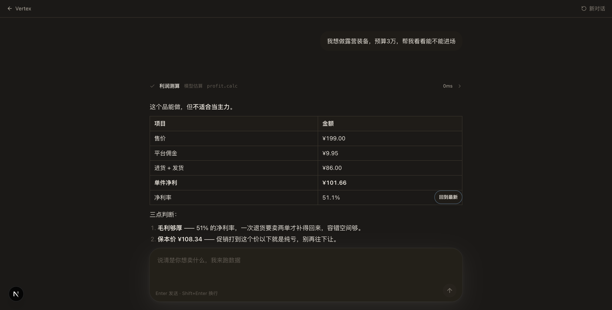

<div align="center">


# Vertex

**面向中小电商卖家的 AI 经营决策智能体**

说清楚你想卖什么，它自己去采集数据、跑分析、给结论。<br>
需要出图就出图，需要盯盘就定时盯。

[](docs/01-架构重构方案.md)
[](LICENSE)
[](https://nextjs.org)
[](https://fastapi.tiangolo.com)
[](https://python.org)
[](CONTRIBUTING.md)



<sub>一次提问 → 一次工具调用 → 一份带表格和判断的结论</sub>

</div>

---

> **📌 当前状态：V2 架构重构中**
>
> 本仓库是 Vertex 的第二代实现，正在按分阶段计划重建。
> 线上运行的仍是第一代（[VERTEX-pro](https://github.com/Frank-789/VERTEX-pro) · [vertex-pro-pink.vercel.app](https://vertex-pro-pink.vercel.app)）。
>
> 重构方案与取舍见 **[docs/01-架构重构方案.md](docs/01-架构重构方案.md)**。

---

## 它解决什么问题

中小电商卖家做经营决策时，工具是割裂的：选品看一个站、比价开一个表、做主图找设计师、盯差评靠手动刷后台。信息散在五六个地方，决策靠经验拍脑袋。

Vertex 把这些收进一条对话。

## 快速开始

```bash
git clone https://github.com/Frank-789/VERTEX-PRO-V2.git
cd VERTEX-PRO-V2

# 后端
cd apps/api
python3 -m venv .venv && .venv/bin/pip install -r requirements.txt
cd ../..

# 前端
cd apps/web && npm install && cd ../..

# 配置
cp .env.example .env      # 至少填一个 AI 供应商的 key，或用下面的 mock
```

**没有 API key 也能跑通全链路。** 仓库里带了一个开发用假供应商：

```bash
# 终端 1 —— 假供应商（监听 8899）
cd apps/api && .venv/bin/python dev/mock_provider.py

# 终端 2 —— 后端（监听 8000）
cd apps/api && .venv/bin/python -m uvicorn src.main:app --reload --port 8000

# 终端 3 —— 前端（监听 3000）
cd apps/web && npm run dev
```

打开 http://localhost:3000。`.env` 里保留 `MOCK_API_KEY=dev` 即可，**不花一分钱**跑通
「工具调用 → 流式回答 → 表情包」整条链路。

验证后端：

```bash
curl localhost:8000/health                            # 供应商与工具状态
cd apps/api && .venv/bin/python tests/test_smoke.py   # 21 项冒烟测试，无需任何 key
```

## 功能

### 一次对话，跑完一次经营判断

用户用大白话提问，Agent 自己决定调哪些工具、按什么顺序调，然后给出结论。

工具调用**出现在回答中间**（左侧轨道），而不是被挤到开头 —— 因为它是「过程中的一步」，不是「一个独立的东西」。



### 拿不到数据就报错，绝不编

这是第一代最危险的问题：采集失败时会生成一份看起来很像真的假数据。
V2 里所有工具的契约是**拿不到就抛错**，界面上明确显示「未配置」或「采集失败」。

利润测算这类纯计算工具不需要任何凭证，因此永远可用；需要凭证的工具
（`ebay.search` 等）在 `/health` 里会单独列出 `pending` 状态，排障不用猜。

### 表情包

20 个原创 SVG 表情，购物袋吉祥物，程序化生成（[scripts/generate_stickers.py](scripts/generate_stickers.py)）。

它承担的是**语气**，不是装饰：算账时是「算账中」，爆单时是「爆单了」，亏钱时是「有风险」。
规则写死在人格提示词里 —— **一条回复最多一个表情；用户说亏钱或遇到纠纷时，禁用表情**。



### 四套色板，跟随系统

`paper`（暖白，默认）/ `linen`（冷纸面）/ `graphite`（深色中性灰）/ `midnight`（深色偏蓝）。
不显式选择时跟随系统深色偏好，选过就听用户的。



## 架构

```
apps/
  web/     Next.js 16 前端（Vercel）
  api/     FastAPI 后端（Docker）
    src/
      core/       配置 · 路径 · 工具注册表 · 供应商路由 · 会话 · Agent 循环
      tools/      平台数据工具（利润测算 / eBay / Apify）
      api/        路由层（SSE）
config/    配置即数据（providers.json 等）
prompts/   提示词双层覆盖（default 进 git / user 覆盖）
data/      持久化根（容器挂载 /data）
docs/      方案与部署文档
```

**三个关键抽象：**

| 抽象 | 作用 |
|---|---|
| **ToolCenter** | 能力只注册一次。第一代有 `tools/` 和 `crawler/` **两套互不相通的注册表**，V2 合并成一份 |
| **ProviderRouter** | 供应商降级逻辑**只此一份**。第一代前后端各写一遍，改一处必忘另一处 |
| **文件即状态** | 会话、事件、任务全部落 JSONL / Markdown，不用数据库也能重启不丢 |

前端经 **同源代理**（`next.config.ts` 的 rewrites）访问后端，因此**没有 CORS**，
且密钥永远不出服务端。

设计取舍详见 [docs/01-架构重构方案.md](docs/01-架构重构方案.md)。

## 部署

| 层 | 平台 | 形态 |
|---|---|---|
| 前端 | Vercel | Next.js 纯 UI，经同源代理转发 |
| 后端 | Docker | 常驻进程，持久卷挂载 `/data` |

后端一行起：

```bash
cp .env.example .env    # 填 DEEPSEEK_API_KEY
docker compose up -d
curl localhost:8000/health
```

端口默认只绑 `127.0.0.1` —— 后端持有全部密钥且**目前没有鉴权**，不该裸暴露公网。

> 智能体运行时需要**常驻进程 + 持久文件系统 + 定时调度**，无法运行在 Serverless 环境。
> Vercel 只承载 UI 这一层。

逐步说明见 [docs/02-部署指南.md](docs/02-部署指南.md)。

## 文档

| 文档 | 内容 |
|---|---|
| [01-架构重构方案](docs/01-架构重构方案.md) | 对标分析、现状体检、迁移映射、分阶段计划、许可证红线 |
| [02-部署指南](docs/02-部署指南.md) | 本地开发、Docker、Vercel、环境变量 |
| [03-配置参考](docs/03-配置参考.md) | `config/*.json` 字段说明、提示词覆盖机制 |
| [PROGRESS.md](PROGRESS.md) | 进度日志 —— 换一个对话窗口也不会失忆 |

## 开发

```bash
cd apps/api && .venv/bin/python tests/test_smoke.py   # 21 项冒烟测试，不需要 key
cd apps/web && npm run build                          # TypeScript 类型检查 + 构建
```

改前端前先读 [apps/web/AGENTS.md](apps/web/AGENTS.md) —— 这版 Next.js 有破坏性变更。

## 路线图

- [x] 前后端打通，对话端到端可跑（工具调用 + 流式 + 表情包）
- [x] 对话界面按公开设计规格重排
- [x] 前端止血：清掉第一代的 `NEXT_PUBLIC_*` 密钥，改同源代理
- [x] Phase 4 部署：`Dockerfile` + `docker-compose.yml`（tini / 非 root / healthcheck / `/data` 卷）
- [ ] Phase 0 收尾：轮换第一代泄露的凭证，清理旧仓库 git 历史
- [ ] Phase 2 持久化：事件日志落盘、领域数据进 Postgres
- [ ] Phase 3 自动化：`issues/*.md` + `when:` 文件自调度 → Store Pilot 真实化

## 许可证

[MIT](LICENSE) © 罗鑫坤 (Frank-789)

---

<div align="center">
<sub>

本项目的架构设计参考了 <a href="https://github.com/TraderAlice/OpenAlice">OpenAlice</a>（AGPL-3.0）的<strong>公开文档与设计思想</strong>。<br>
未复制其任何源代码 —— 学习的是架构模式（统一工具注册表、供应商路由、文件态自调度），<br>
所有实现均为独立编写，本项目以 <strong>MIT</strong> 发布。

</sub>
</div>
